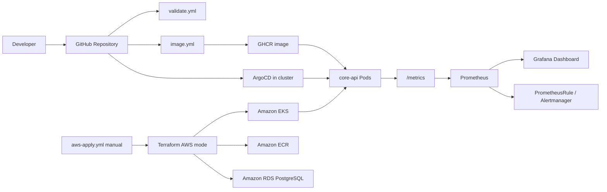

# Kubernetes GitOps Delivery Platform

A production-style DevOps portfolio project that takes a small web service from container image to Kubernetes deployment, AWS infrastructure, GitOps delivery, and observability.

The goal of this project is not to show a toy Kubernetes manifest. It is to demonstrate the practical skills expected from a junior-to-mid DevOps or platform engineer: Docker, Helm, Argo CD, Terraform, AWS, CI/CD, Prometheus, Grafana, and incident-style troubleshooting.

## Deployment Modes

This repo supports two paths without mixing their credentials or blast radius.

**Local/demo mode** is for kind, Docker Desktop Kubernetes, Colima, KodeKloud, or any existing cluster with a working kubeconfig. It requires no AWS credentials. GitHub Actions validates the repo and can publish `ghcr.io/jimmy-do/core-api`; ArgoCD running inside the cluster pulls this repo and syncs `container-platform/helm/core-api` with `values-local.yaml`.

**AWS mode** is the production-style path. Terraform creates AWS infrastructure and the protected `aws-apply.yml` workflow is manual-only through `workflow_dispatch`. AWS credentials, OIDC roles, remote state, ECR, EKS, and RDS are used only in this mode.

GitHub Actions intentionally does not deploy directly into KodeKloud or any temporary cluster. The delivery flow is:

```text
Developer pushes code
  -> GitHub Actions validates, lints, and builds
  -> GitHub Actions publishes an image to GHCR where appropriate
  -> ArgoCD running inside Kubernetes pulls from GitHub
  -> ArgoCD syncs the app into the cluster
```

## What This Demonstrates

This repository shows that I can:

- Package an application into a secure container image.
- Deploy it to Kubernetes with Helm using health probes, resource limits, security contexts, and NetworkPolicy.
- Use Argo CD so Git remains the source of truth for deployed state.
- Build AWS infrastructure with Terraform modules for VPC, ECR, EKS, RDS, IAM/OIDC, and remote state.
- Use GitHub Actions with AWS OIDC instead of long-lived cloud credentials.
- Expose application metrics and connect them to Prometheus, Grafana, and alerting rules.
- Debug real deployment issues across container registries, Kubernetes, Terraform, AWS, and observability tooling.

## Architecture



## Repository Layout

```text
container-platform/
  app/                    Flask service with health and metrics endpoints
  Dockerfile              Production-style container image
  helm/core-api/          Helm chart for Kubernetes deployment
  argocd/                 Argo CD application manifests

infrastructure-cicd/
  argocd-apps/            ArgoCD Applications for local/demo, AWS, observability
  github-actions/         CI/CD workflow documentation
  terraform/bootstrap/    S3 + DynamoDB remote state bootstrap
  terraform/envs/local/   kubeconfig-driven local/demo cluster bootstrap
  terraform/envs/aws/     protected AWS environment composition
  terraform/prod/         AWS production root module
  terraform/modules/      AWS platform, cluster bootstrap, VPC, EKS, ECR, RDS, IRSA

observability/
  external-secrets/       External Secrets Operator wrapper chart
  kube-prometheus-stack/  Prometheus, Alertmanager, and Grafana wrapper chart
  loki/                   Loki and Promtail wrapper charts
  core-api-observability/ ServiceMonitor, PrometheusRule, Grafana dashboard

docs/
  testing.md              What was validated and what was learned
  playground-runbook.md   Reproducible KodeKloud test sequence
```

## Platform Components

### Application Platform

The `core-api` service exposes:

- `GET /`
- `GET /health/live`
- `GET /health/ready`
- `GET /metrics`

The Helm chart includes:

- Deployment, Service, Ingress, ServiceAccount, HPA, and NetworkPolicy
- startup, liveness, and readiness probes
- CPU and memory requests/limits
- non-root container execution
- read-only root filesystem
- dropped Linux capabilities
- production override values for AWS/EKS-style deployment

### Infrastructure and CI/CD

Terraform manages:

- S3 and DynamoDB remote state backend
- VPC with public/private subnets across three AZs
- Internet Gateway, NAT Gateway, route tables, and subnet associations
- ECR repository and lifecycle policy
- EKS control plane and managed node group
- RDS PostgreSQL in private subnets
- IAM roles and policy attachments
- GitHub Actions OIDC provider and deploy role
- EKS access entry scoped to the application namespace

GitHub Actions is split by trust boundary:

- `validate.yml`: no AWS credentials; Terraform fmt/init/validate, Helm lint/template, ArgoCD YAML lint, Docker build.
- `image.yml`: no AWS credentials; builds and pushes `ghcr.io/jimmy-do/core-api` with `GITHUB_TOKEN`.
- `aws-apply.yml`: manual-only AWS Terraform path using OIDC and a protected GitHub environment.

Terraform is organized around environment intent:

- `terraform/bootstrap`: AWS-only S3/DynamoDB remote state bootstrap.
- `terraform/modules/aws-platform`: wraps the existing real VPC, EKS, ECR, RDS, IAM, and observability IRSA modules.
- `terraform/modules/cluster-bootstrap`: installs cluster foundation components into an existing Kubernetes cluster with Kubernetes/Helm providers.
- `terraform/envs/local`: kubeconfig-driven local/demo mode; no AWS provider or credentials.
- `terraform/envs/aws`: AWS mode; remote state, AWS provider, and optional second-phase cluster bootstrap using `data "aws_eks_cluster"` and `data "aws_eks_cluster_auth"`.

### Observability

The observability layer includes:

- Prometheus scraping through `ServiceMonitor`
- Grafana dashboard for core-api golden signals
- Prometheus alerts for error rate, pod restarts, and memory pressure
- External Secrets integration for Alertmanager webhook secrets
- Loki and Promtail wrappers for log collection

## Validation Status

This project has been tested in KodeKloud Kubernetes and AWS playground environments.

| Area | Validation | Result |
|---|---|---|
| Container image | Built, pushed to GHCR, pulled by Kubernetes | Passed |
| Multi-arch image | Rebuilt for amd64/arm64 compatibility | Passed |
| Helm deployment | Installed `core-api` with local playground overrides | Passed |
| App endpoints | `/`, `/health/live`, `/health/ready`, `/metrics` | Passed |
| Prometheus scrape | ServiceMonitor connected app metrics to Prometheus | Passed |
| Grafana | `core-api Golden Signals` dashboard imported and rendered | Passed |
| Terraform bootstrap | S3 backend bucket and DynamoDB lock table created | Passed |
| Terraform prod plan | Full AWS stack planned successfully | Passed |
| AWS apply | EKS and RDS created in KodeKloud after lab-specific overrides | Passed |

See [docs/testing.md](docs/testing.md) for the validation notes and [docs/playground-runbook.md](docs/playground-runbook.md) for the exact reproduction sequence.

## Key Troubleshooting Scenarios

Real issues found and resolved during testing:

- GHCR image pull failed with `401 Unauthorized` because the package was private.
- Kubernetes image pull failed because an Apple Silicon image did not match amd64 playground nodes.
- Prometheus returned no app metrics because ServiceMonitor labels did not match the live Service.
- Grafana dashboard ConfigMap targeted the wrong namespace for the playground install.
- Terraform `for_each` failed because RDS security group rules used apply-time values as keys.
- KodeKloud EKS required lab-approved IAM role names for `iam:PassRole`.
- RDS PostgreSQL `16.3` was unavailable in the playground region, requiring an available patch version.

These are the kinds of issues that happen in real platform work: auth, architecture, labels/selectors, state, IAM, cloud service constraints, and environment differences.

## Quick Start

Run Terraform formatting:

```bash
terraform -chdir=infrastructure-cicd/terraform fmt -check -recursive
```

Run Terraform validation for the prod root after backend initialization:

```bash
cd infrastructure-cicd/terraform/prod
terraform validate
```

Bootstrap local/demo platform services:

```bash
cd infrastructure-cicd/terraform/envs/local
cp terraform.tfvars.example terraform.tfvars
terraform init
terraform apply
```

Apply the ArgoCD Applications from the repository root:

```bash
kubectl apply -f infrastructure-cicd/argocd-apps/core-api-demo.yaml
kubectl apply -f infrastructure-cicd/argocd-apps/observability.yaml
kubectl get applications -n argocd
```

Or install the application chart directly in a playground cluster:

```bash
helm upgrade --install core-api container-platform/helm/core-api \
  --namespace core-api \
  --create-namespace \
  --values container-platform/helm/core-api/values.yaml \
  --values container-platform/helm/core-api/values-local.yaml
```

Port-forward and test:

```bash
kubectl -n core-api port-forward svc/core-api 18080:80

curl http://127.0.0.1:18080/
curl http://127.0.0.1:18080/health/live
curl http://127.0.0.1:18080/health/ready
curl http://127.0.0.1:18080/metrics
```

## Troubleshooting

- Kubeconfig/context: set `kube_context` explicitly in `terraform/envs/local/terraform.tfvars`; do not rely on whatever context happens to be current.
- GHCR image pulls: public packages need no pull secret; private GHCR packages require a Kubernetes `docker-registry` secret with `read:packages`.
- ArgoCD sync: check `kubectl get applications -n argocd` and inspect the app in the ArgoCD UI.
- Missing namespaces: `cluster-bootstrap` creates `argocd`, `monitoring`, and `core-api`; ArgoCD Applications also use `CreateNamespace=true`.
- External Secrets local mode: disabled by default. Enable only after adding a fake or real `ClusterSecretStore`.
- AWS credentials: required only for `terraform/bootstrap`, `terraform/envs/aws`, and the manual `aws-apply.yml` workflow.

## Why This Project Matters

This project is intentionally scoped like work a DevOps engineer would do on a real team:

- create repeatable infrastructure
- ship application changes safely
- keep secrets out of Git
- make deployments observable
- document failure modes
- distinguish production design from playground constraints

It is built to be readable by hiring managers while still giving engineers enough depth to review the implementation.
