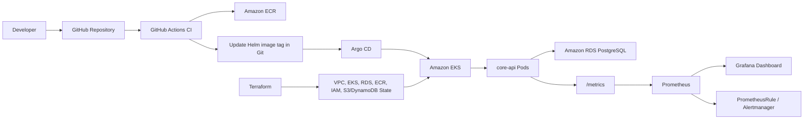

# Kubernetes GitOps Delivery Platform

A production-style DevOps portfolio project that takes a small web service from container image to Kubernetes deployment, AWS infrastructure, GitOps delivery, and observability.

The goal of this project is not to show a toy Kubernetes manifest. It is to demonstrate the practical skills expected from a junior-to-mid DevOps or platform engineer: Docker, Helm, Argo CD, Terraform, AWS, CI/CD, Prometheus, Grafana, and incident-style troubleshooting.

## What This Demonstrates

This repository shows that I can:

- Package an application into a secure container image.
- Deploy it to Kubernetes with Helm using health probes, resource limits, security contexts, and NetworkPolicy.
- Use Argo CD so Git remains the source of truth for deployed state.
- Build AWS infrastructure with Terraform modules for VPC, ECR, EKS, RDS, IAM/OIDC, and remote state.
- Use GitHub Actions with AWS OIDC instead of long-lived cloud credentials.
- Expose application metrics and connect them to Prometheus, Grafana, and alerting rules.
- Debug real deployment issues across container registries, Kubernetes, Terraform, AWS, and observability tooling.

## Architecture



## Repository Layout

```text
container-platform/
  app/                    Flask service with health and metrics endpoints
  Dockerfile              Production-style container image
  helm/core-api/          Helm chart for Kubernetes deployment
  argocd/                 Argo CD application manifests

infrastructure-cicd/
  terraform/bootstrap/    S3 + DynamoDB remote state bootstrap
  terraform/prod/         AWS production root module
  terraform/modules/      VPC, ECR, EKS, RDS, observability IRSA modules

observability/
  external-secrets/       External Secrets Operator wrapper chart
  kube-prometheus-stack/  Prometheus, Alertmanager, and Grafana wrapper chart
  loki/                   Loki and Promtail wrapper charts
  core-api-observability/ ServiceMonitor, PrometheusRule, Grafana dashboard

docs/
  testing.md              What was validated and what was learned
  playground-runbook.md   Reproducible KodeKloud test sequence
```

## Platform Components

### Application Platform

The `core-api` service exposes:

- `GET /`
- `GET /health/live`
- `GET /health/ready`
- `GET /metrics`

The Helm chart includes:

- Deployment, Service, Ingress, ServiceAccount, HPA, and NetworkPolicy
- startup, liveness, and readiness probes
- CPU and memory requests/limits
- non-root container execution
- read-only root filesystem
- dropped Linux capabilities
- production override values for AWS/EKS-style deployment

### Infrastructure and CI/CD

Terraform manages:

- S3 and DynamoDB remote state backend
- VPC with public/private subnets across three AZs
- Internet Gateway, NAT Gateway, route tables, and subnet associations
- ECR repository and lifecycle policy
- EKS control plane and managed node group
- RDS PostgreSQL in private subnets
- IAM roles and policy attachments
- GitHub Actions OIDC provider and deploy role
- EKS access entry scoped to the application namespace

GitHub Actions handles:

- Docker build
- Trivy image scan before push
- ECR push
- Helm values image tag update
- GitOps handoff to Argo CD
- rollback backstop using `kubectl rollout undo`

### Observability

The observability layer includes:

- Prometheus scraping through `ServiceMonitor`
- Grafana dashboard for core-api golden signals
- Prometheus alerts for error rate, pod restarts, and memory pressure
- External Secrets integration for Alertmanager webhook secrets
- Loki and Promtail wrappers for log collection

## Validation Status

This project has been tested in KodeKloud Kubernetes and AWS playground environments.

| Area | Validation | Result |
|---|---|---|
| Container image | Built, pushed to GHCR, pulled by Kubernetes | Passed |
| Multi-arch image | Rebuilt for amd64/arm64 compatibility | Passed |
| Helm deployment | Installed `core-api` with local playground overrides | Passed |
| App endpoints | `/`, `/health/live`, `/health/ready`, `/metrics` | Passed |
| Prometheus scrape | ServiceMonitor connected app metrics to Prometheus | Passed |
| Grafana | `core-api Golden Signals` dashboard imported and rendered | Passed |
| Terraform bootstrap | S3 backend bucket and DynamoDB lock table created | Passed |
| Terraform prod plan | Full AWS stack planned successfully | Passed |
| AWS apply | EKS and RDS created in KodeKloud after lab-specific overrides | Passed |

See [docs/testing.md](docs/testing.md) for the validation notes and [docs/playground-runbook.md](docs/playground-runbook.md) for the exact reproduction sequence.

## Notable Troubleshooting Wins

Real issues found and resolved during testing:

- GHCR image pull failed with `401 Unauthorized` because the package was private.
- Kubernetes image pull failed because an Apple Silicon image did not match amd64 playground nodes.
- Prometheus returned no app metrics because ServiceMonitor labels did not match the live Service.
- Grafana dashboard ConfigMap targeted the wrong namespace for the playground install.
- Terraform `for_each` failed because RDS security group rules used apply-time values as keys.
- KodeKloud EKS required lab-approved IAM role names for `iam:PassRole`.
- RDS PostgreSQL `16.3` was unavailable in the playground region, requiring an available patch version.

These are the kinds of issues that happen in real platform work: auth, architecture, labels/selectors, state, IAM, cloud service constraints, and environment differences.

## Quick Start

Run Terraform formatting:

```bash
terraform -chdir=infrastructure-cicd/terraform fmt -check -recursive
```

Run Terraform validation for the prod root after backend initialization:

```bash
cd infrastructure-cicd/terraform/prod
terraform validate
```

Install the application chart locally or in a playground cluster:

```bash
helm upgrade --install core-api container-platform/helm/core-api \
  --namespace core-api \
  --create-namespace \
  --set image.repository=ghcr.io/jimmy-do/core-api \
  --set image.tag=latest \
  --set ingress.enabled=false \
  --set networkPolicy.enabled=false
```

Port-forward and test:

```bash
kubectl -n core-api port-forward svc/core-api 18080:80

curl http://127.0.0.1:18080/
curl http://127.0.0.1:18080/health/live
curl http://127.0.0.1:18080/health/ready
curl http://127.0.0.1:18080/metrics
```

## Why This Project Matters

This project is intentionally scoped like work a DevOps engineer would do on a real team:

- create repeatable infrastructure
- ship application changes safely
- keep secrets out of Git
- make deployments observable
- document failure modes
- distinguish production design from playground constraints

It is built to be readable by hiring managers while still giving engineers enough depth to review the implementation.
